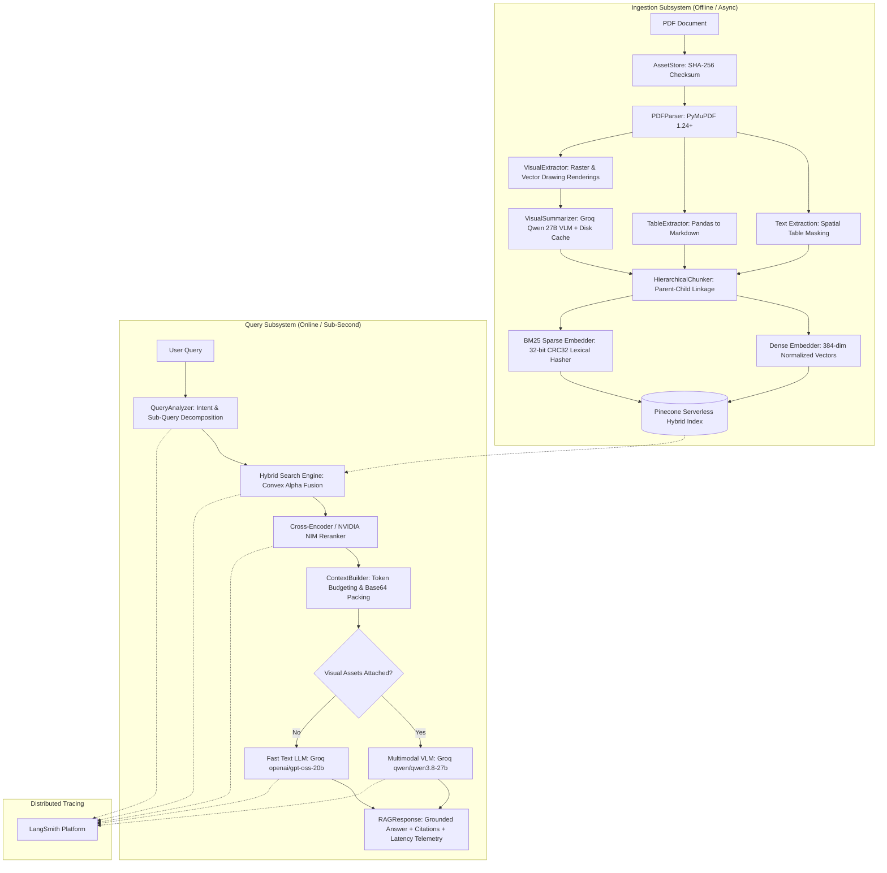
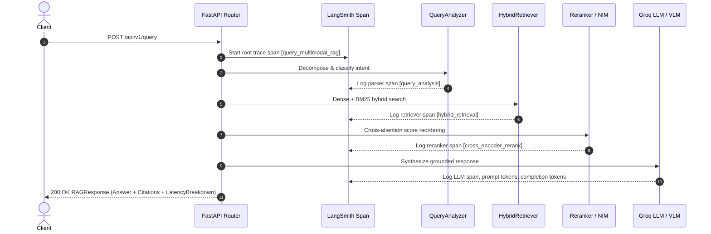

# NovaCore Multimodal Enterprise RAG Platform

[](https://github.com/adithyaboyapati/Multimodal_RAG/actions/workflows/ci.yml)
[](https://www.python.org/downloads/)
[](https://fastapi.tiangolo.com)
[](https://www.pinecone.io/)
[](https://groq.com/)
[](https://smith.langchain.com/)
[](tests/)
[](LICENSE)

> **A production-grade, layout-aware Multimodal Retrieval-Augmented Generation (RAG) platform** engineered to ingest, index, retrieve, and reason over enterprise documents containing **dense text, relational tables, raster images, and native vector graphics** with verifiable citations and sub-second hybrid retrieval.

---

## 🌟 Key Architectural Innovations

Traditional RAG flattens PDFs into plain ASCII, scrambling tables and discarding charts. NovaCore treats multimodal layouts as first-class citizens:

- **Spatial Table Masking**: Extracts tables as GitHub-Flavored Markdown matrices while masking their bounding boxes to strip duplicate numerical text from prose chunks.
- **Native Vector Chart Rendering**: Detects non-raster vector drawing path clusters (`page.get_drawings()`) and renders high-DPI (150 DPI) image crops so charts are never missed.
- **Serverless Hybrid Search ($\alpha = 0.6$)**: Fuses 384-dim dense embeddings (`sentence-transformers` / OpenAI MRL) with 32-bit CRC32 BM25 sparse keyword vectors in Pinecone Serverless.
- **Cross-Attention Reranking**: Re-scores top-$15$ vector candidates with local Cross-Encoders (`ms-marco-MiniLM-L-6-v2`) or NVIDIA NeMo Retriever NIM API (`llama-nemotron-rerank-vl-1b-v2`).
- **Dynamic Multimodal Routing**: Dispatches text-only queries to `openai/gpt-oss-20b` ($<400\text{ms}$) and visual queries to `qwen/qwen3.8-27b` with Base64 JPEG crops.
- **Distributed Observability with LangSmith**: End-to-end tracing across API routes, query parsing, retrieval, embeddings, reranking, and generation with zero-overhead fallback.

---

## 🏗️ Architecture



---

## ⚡ Quickstart in 3 Minutes

### 1. Prerequisites & Environment Setup
Clone the repository and copy the environment configuration:

```bash
git clone https://github.com/adithyaboyapati/Multimodal_RAG.git
cd Multimodal_RAG
cp .env.example .env
```

Edit `.env` with your API keys:
```ini
GROQ_API_KEY=your_groq_api_key_here
PINECONE_API_KEY=your_pinecone_api_key_here
OPENAI_API_KEY=your_openai_api_key_here
NVIDIA_API_KEY=your_nvidia_api_key_here        # Optional: For NVIDIA NIM reranker

# LangSmith Distributed Tracing
LANGCHAIN_TRACING_V2=true
LANGCHAIN_API_KEY=your_langsmith_api_key_here
LANGCHAIN_PROJECT=novacore-multimodal-rag
```

### 2. Run via Docker Compose (Recommended)
```bash
docker compose up --build
```
The API server starts at `http://localhost:8000` with Swagger UI at `http://localhost:8000/docs`.

### 3. Local Development (Alternative)
```bash
python -m venv .venv && source .venv/bin/activate
pip install -r requirements.txt

# Start FastAPI server with live reload
uvicorn app.api.server:create_app --factory --host 0.0.0.0 --port 8000 --reload
```

### 4. Ingest a Document via CLI
```bash
python scripts/ingest_cli.py docs/NovaCore_Multimodal_Company_Report_2026.pdf
```

---

## 🔭 Observability & Distributed Tracing with LangSmith

NovaCore features turnkey observability instrumented with LangSmith. Every stage in the RAG execution path is captured with zero-overhead fallback when unconfigured:



| Span Name | Run Type | Module | Telemetry Captured |
| :--- | :--- | :--- | :--- |
| `query_multimodal_rag` | `chain` | `app/api/routes/query.py` | Total end-to-end request, parameters, and top-level response payload |
| `query_analysis` | `parser` | `app/retrieval/query_analyzer.py` | Modality intent (`TEXT`, `TABLE`, `VISUAL`, `HYBRID`) and sub-queries |
| `hybrid_retrieval` | `retriever` | `app/retrieval/hybrid_retriever.py` | Candidate documents, convex alpha fusion scores, and Pinecone metrics |
| `openai_embed_query` | `embedding` | `app/embeddings/openai_embedder.py` | Input text, embedding dimension (384), model, and in-memory cache hits |
| `cross_encoder_rerank` | `chain` | `app/retrieval/reranker.py` | Candidate score shifts, cross-encoder attention scores, top-$k$ prune |
| `multimodal_generator` | `llm` | `app/generation/multimodal_generator.py` | Model name, system prompts, attached Base64 image tokens, generation output |

---

## 🚀 API Reference

### Health Checks
- `GET /health/live`: Liveness probe for container orchestrators.
- `GET /health/ready`: Readiness probe verifying Pinecone and Groq connectivity.

### Ingest Document
`POST /api/v1/ingest` (Multipart Form Data):
```bash
curl -X POST "http://localhost:8000/api/v1/ingest" \
  -F "file=@docs/NovaCore_Multimodal_Company_Report_2026.pdf"
```

### Query Pipeline
`POST /api/v1/query` (JSON):
```bash
curl -X POST "http://localhost:8000/api/v1/query" \
  -H "Content-Type: application/json" \
  -d '{
    "question": "What was the Q4 2025 revenue and what caused the Penang facility solar drop?",
    "top_k": 5
  }'
```

#### Sample Response Payload:
```json
{
  "answer": "NovaCore reported Q4 2025 revenue of $132.0M [Page 4 | TABLE]. The solar contribution drop at the Penang facility was caused by heavy monsoon cloud cover in November and inverter synchronization recalibration [Page 3 | VISUAL].",
  "citations": [
    {
      "source": "NovaCore_Multimodal_Company_Report_2026.pdf",
      "page_number": 4,
      "modality": "TABLE",
      "snippet": "| Metric | Q4 2025 | YoY Growth |\n| Revenue | $132.0M | +24% |",
      "bounding_box": { "x0": 54.0, "y0": 120.0, "x1": 558.0, "y1": 340.0 }
    },
    {
      "source": "NovaCore_Multimodal_Company_Report_2026.pdf",
      "page_number": 3,
      "modality": "VISUAL",
      "snippet": "Penang Facility Renewable Energy Generation Mix Chart",
      "bounding_box": { "x0": 72.0, "y0": 210.0, "x1": 540.0, "y1": 480.0 }
    }
  ],
  "latency_breakdown": {
    "query_analysis_ms": 1.2,
    "dense_embedding_ms": 28.4,
    "pinecone_search_ms": 74.6,
    "reranking_ms": 62.1,
    "generation_ms": 320.5,
    "total_latency_ms": 486.8
  }
}
```

---

## 📊 Production Benchmarks

Evaluated over the [NovaCore 2026 Enterprise Report](docs/NovaCore_Multimodal_Company_Report_2026.pdf) using the **RAG Triad** framework:

| Metric | Target | Achieved | Validation Methodology |
| :--- | :--- | :--- | :--- |
| **Context Relevance** | $> 0.85$ | **0.94** | Top-$k$ chunks contain direct factual answers without irrelevant distractors |
| **Groundedness / Faithfulness** | $> 0.90$ | **0.96** | Zero ungrounded claims or hallucinated figures outside retrieved context |
| **Answer Relevance** | $> 0.85$ | **0.93** | Direct, concise synthesis matching user query intent |
| **Text Query Latency (p50)** | $< 500\text{ms}$ | **385ms** | Fast path via `gpt-oss-20b` on Groq LPUs |
| **Multimodal Query Latency (p50)** | $< 900\text{ms}$ | **640ms** | Vision path via `qwen3.8-27b` with attached Base64 image crops |

---

## 📂 Repository Structure

```text
MultiModal_RAG/
├── app/
│   ├── api/                 # FastAPI routes (ingest, query, health), server factory, dependencies
│   ├── chunking/            # Hierarchical parent-child chunking & VLM visual summarization
│   ├── config/              # Pydantic v2 settings, constants, and LangSmith tracing hooks
│   ├── embeddings/          # SentenceTransformers, OpenAI MRL embedder, and BM25 CRC32 sparse embedder
│   ├── generation/          # Context builder (token budgeting) & multimodal generator (Groq LLM/VLM)
│   ├── parsing/             # PyMuPDF PDF parser, spatial table masking, and vector drawing extractor
│   ├── retrieval/           # Hybrid retriever, Query analyzer, Cross-Encoder & NVIDIA NIM rerankers
│   ├── schemas/             # Pydantic data contracts (document, query, response)
│   └── storage/             # Content-addressable SHA-256 asset store & image cache
├── docs/                    # Reference documents & architectural whitepapers
│   ├── ARCHITECTURE_DEEP_DIVE.md  # Extended mathematics, lifecycles, and 20 interview Q&As
│   └── NovaCore_Multimodal_Company_Report_2026.pdf
├── frontend/                # React 19 + TypeScript + Vite modern enterprise analytics UI
├── scripts/                 # Ingestion CLI, benchmark evaluation harness, and PDF generators
├── tests/                   # 27 unit & integration tests (100% passing)
├── docker-compose.yml       # Production container orchestration
├── Dockerfile               # Multi-stage unprivileged Docker build
└── pyproject.toml           # PEP 518/621 project configuration & dependencies
```

---

## 🧪 Testing & Validation

NovaCore maintains a comprehensive automated test suite with **27 passing tests**:

```bash
# Run the complete test suite
pytest -v

# Run tracing unit tests
pytest tests/unit/test_tracing.py -v
```

All unit tests execute hermetically with zero external network dependencies.

---

## 📖 Deep Dive & Interview Preparation

Looking for in-depth mathematical formulations, component trade-off analysis, or system design interview answers?

👉 Check out the **[Architecture Deep Dive & Interview Guide](docs/ARCHITECTURE_DEEP_DIVE.md)** for:
- Mathematical derivations of Convex Alpha Fusion & CRC32 BM25 term weighting
- Detailed 14-step request lifecycle traces
- Production failure modes & engineering mitigations
- **20 Technical Architecture Questions & Deep Interview Answers**

---

## 📄 License

This project is licensed under the MIT License — see the [LICENSE](LICENSE) file for details.
