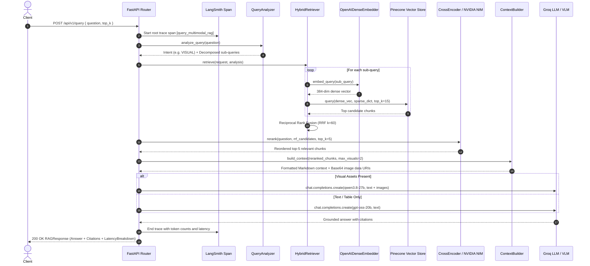

# NovaCore Multimodal RAG — Deep Dive & Technical Reference

> **Comprehensive companion guide to the NovaCore Multimodal Enterprise RAG Platform.**
> This document details the underlying mathematics, design trade-offs, step-by-step request lifecycles, and 20 architectural interview questions.

---

## Table of Contents
1. [Mathematical Formulations & Core Algorithms](#1-mathematical-formulations--core-algorithms)
2. [Component-by-Component Technical Analysis](#2-component-by-component-technical-analysis)
3. [End-to-End Request Lifecycle (14-Step Trace)](#3-end-to-end-request-lifecycle-14-step-trace)
4. [Failure Modes & Production Mitigations](#4-failure-modes--production-mitigations)
5. [Design Decisions & Alternative Trade-offs](#5-design-decisions--alternative-trade-offs)
6. [Multimodal RAG Learning Map](#6-multimodal-rag-learning-map)
7. [System Design & Interview Preparation Guide](#7-system-design--interview-preparation-guide)

---

## 1. Mathematical Formulations & Core Algorithms

### 1.1 Convex Alpha Hybrid Search Fusion
In Pinecone Serverless with hybrid namespaces, query vectors combine dense semantic embeddings and sparse BM25 lexical vectors via a convex combination of inner products:

$$\text{Score}(q, d) = \alpha \cdot \langle \mathbf{q}_{\text{dense}}, \mathbf{d}_{\text{dense}} \rangle + (1 - \alpha) \cdot \langle \mathbf{q}_{\text{sparse}}, \mathbf{d}_{\text{sparse}} \rangle$$

- $\mathbf{q}_{\text{dense}}, \mathbf{d}_{\text{dense}} \in \mathbb{R}^{384}$, normalized such that $\|\mathbf{q}\|_2 = \|\mathbf{d}\|_2 = 1.0$. Because vectors are L2-normalized, the inner product equals cosine similarity.
- $\mathbf{q}_{\text{sparse}}, \mathbf{d}_{\text{sparse}} \in \mathbb{R}^{2^{32}-1}$, sparse dictionaries mapped to 32-bit CRC32 hash buckets.
- $\alpha = 0.6$: Allocates $60\%$ weight to conceptual semantics and $40\%$ weight to exact alphanumeric entity matching.

### 1.2 Deterministic BM25 Lexical Hashing
To eliminate heavyweight C++ dependencies (e.g. Java/Lucene, Elasticsearch), lexical term frequency is computed via Python's native `zlib.crc32`:

$$\text{index}(t) = \text{CRC32}(t) \pmod{2^{31} - 1}$$

$$\text{TF}(t, d) = \frac{f(t, d) \cdot (k_1 + 1)}{f(t, d) + k_1 \cdot \left(1 - b + b \cdot \frac{|d|}{\text{avgdl}}\right)}$$

- Default parameters: $k_1 = 1.5, b = 0.75, \text{avgdl} = 256$.
- Provides exact keyword recall for product serial numbers (e.g., `NC-942`) and currency figures (e.g., `$41.2M`) where neural bi-encoders drift.

### 1.3 Reciprocal Rank Fusion (RRF) for Multi-Query Decomposition
When a user prompt contains multi-part questions (e.g., *"What was regional revenue and what caused the Penang solar drop?"*), the query analyzer generates parallel sub-queries $Q = \{q_1, q_2, \dots, q_m\}$. Each sub-query yields a ranked candidate list $R(q)$. Results are merged via Reciprocal Rank Fusion:

$$\text{RRF\_Score}(d) = \sum_{q \in Q} \frac{1}{k + \text{Rank}(d, q)}, \quad \text{where } k = 60$$

- The damping constant $k = 60$ prevents top-ranked outliers in one sub-query from dominating results unless supported by consensus across queries.

### 1.4 Cross-Encoder Attention Mechanics
Candidate retrieval pools ($3\times k$) are re-ranked using `cross-encoder/ms-marco-MiniLM-L-6-v2` or NVIDIA NeMo Retriever NIM API (`nvidia/llama-nemotron-rerank-vl-1b-v2`):

$$\text{Input} = [\text{CLS}] \circ q \circ [\text{SEP}] \circ d \circ [\text{SEP}]$$

$$\text{Score}(q, d) = \sigma\left(\mathbf{W} \cdot \text{Transformer}(\text{Input})_{[\text{CLS}]}\right)$$

Unlike bi-encoders which compute independent representations $\mathbf{q}$ and $\mathbf{d}$, cross-attention allows query tokens to directly attend to candidate document tokens across all self-attention layers, eliminating false-positive visual summaries before prompt assembly.

---

## 2. Component-by-Component Technical Analysis

| Component | Module | Responsibility | Key Classes / Functions |
| :--- | :--- | :--- | :--- |
| **Settings** | `app/config/settings.py` | Validates environment variables, API keys, and model parameters via Pydantic v2. | `Settings`, `get_settings()` |
| **Tracing** | `app/config/tracing.py` | Distributed telemetry with LangSmith; automatic transparent fallback on offline runs. | `@traceable` |
| **Asset Store** | `app/storage/asset_store.py` | Content-addressable SHA-256 storage, image caching, Base64 JPEG data URI serialization. | `AssetStore` |
| **PDF Parser** | `app/parsing/pdf_parser.py` | PyMuPDF layout analysis, page block traversal, and spatial table masking. | `PDFParser` |
| **Table Engine** | `app/parsing/table_extractor.py` | Table boundary detection and Pandas DataFrame sanitization to Markdown tables. | `TableExtractor` |
| **Visual Engine**| `app/parsing/visual_extractor.py` | Raster extraction and vector drawing cluster rendering (`get_drawings()`) to high-DPI PNGs. | `VisualExtractor` |
| **VLM Summarizer**| `app/chunking/visual_summarizer.py` | Disk-cached visual chart summarization using Groq's Qwen 27B Vision model. | `VisualSummarizer` |
| **Hierarchical Chunker**| `app/chunking/hierarchical.py`| Parent-child chunking: 400-token child retrieval units linked to full-page parent documents. | `HierarchicalChunker` |
| **Dense Embedder**| `app/embeddings/dense.py` / `openai_embedder.py` | Generates 384-dim normalized dense vectors with GPU/MPS or OpenAI MRL dimensions. | `OpenAIDenseEmbedder` |
| **Sparse Embedder**| `app/embeddings/sparse.py`| BM25 term weighting over 32-bit CRC32 lexical hash spaces. | `BM25SparseEmbedder` |
| **Vector Store** | `app/retrieval/vector_store.py` | Pinecone Serverless hybrid vector index management, upsert batching, and scoped deletion. | `PineconeHybridVectorStore` |
| **Query Analyzer**| `app/retrieval/query_analyzer.py`| Sub-query decomposition, modality intent classification (`TEXT`, `TABLE`, `VISUAL`), regex filters. | `QueryAnalyzer` |
| **Reranker** | `app/retrieval/reranker.py` / `nvidia_reranker.py` | Local Cross-Encoder or NVIDIA NIM cloud cross-attention candidate re-scoring. | `CrossEncoderReranker`, `NVIDIAReranker` |
| **Context Builder**| `app/generation/context_builder.py`| Strict token budgeting (16k char cap), citation mapping, and Base64 image payload assembly. | `ContextBuilder` |
| **Generator** | `app/generation/multimodal_generator.py`| Dynamic dispatch to fast Text LLM (`gpt-oss-20b`) or Multimodal VLM (`qwen3.8-27b`). | `MultimodalGenerator` |
| **API Server** | `app/api/server.py` | FastAPI application factory, lifespan pre-warming, CORS, process time headers, routing. | `create_app()`, `lifespan` |

---

## 3. End-to-End Request Lifecycle (14-Step Trace)

When a client submits `POST /api/v1/query`:



1. **HTTP Ingestion**: Client sends JSON request with user question and optional filter criteria.
2. **Process-Time Middleware**: Records start timestamp (`time.perf_counter()`).
3. **LangSmith Root Span**: Generates trace ID and tags execution context.
4. **Query Analysis**: Evaluates regex patterns to detect target modalities and decomposes compound prompts.
5. **Embedding Synthesis**: Dense embedder checks in-memory cache; if miss, computes 384-dim normalized vector.
6. **BM25 Lexical Hashing**: Encodes query into 32-bit CRC32 indices and term weights.
7. **Pinecone Hybrid Query**: Dispatches convex combination search to Pinecone Serverless.
8. **RRF Aggregation**: Combines multi-query candidate pools into a unified consensus ranking.
9. **Cross-Attention Reranking**: Scores top-15 candidate pairs to filter false-positive semantic matches.
10. **Parent Resolution**: Checks child chunk metadata to attach parent document context if needed.
11. **Context & Asset Packing**: Token budgeter caps prompt at 16,000 characters; loads high-DPI images into Base64 JPEG URIs.
12. **Model Routing**: Dispatches to `qwen/qwen3.8-27b` if visual assets are attached, or `openai/gpt-oss-20b` for text-only.
13. **Citation Resolution**: Formats verified citations `[Page X | MODALITY]` with source bounding boxes.
14. **Telemetry Serialization**: Returns `RAGResponse` with millisecond latency metrics across all stages.

---

## 4. Failure Modes & Production Mitigations

### 1. Vector Drawing Charts Discarded by Standard Extractors
- **Symptom**: Financial reports often generate bar charts via PDF line/curve commands rather than embedded raster PNGs. `page.get_images()` returns an empty list.
- **Root Cause**: PDF vector graphics are stored as drawing operator streams (`re`, `m`, `c`), not image XObjects.
- **Mitigation**: `VisualExtractor` scans `page.get_drawings()`. If $\ge 15$ vector paths exist on a page without raster images, it computes their bounding box union and renders a 150 DPI raster crop via `page.get_pixmap(clip=rect)`.

### 2. Duplicate Table Contamination
- **Symptom**: Numbers from tables appear twice in search results—once as unformatted text strings and once as Markdown tables.
- **Root Cause**: `page.get_text("blocks")` extracts all text glyphs on the page, including table cells.
- **Mitigation**: `PDFParser` runs spatial masking: any text block overlapping an extracted table bounding box by $>40\%$ area is dropped from the text extraction stream.

### 3. Semantic Drift on Alphanumeric Identifiers
- **Symptom**: Querying for part code `NC-942` retrieves `NC-943` or generic compliance paragraphs because dense cosine distance is nearly identical.
- **Root Cause**: Neural bi-encoders tokenize unfamiliar alphanumeric codes into subwords, losing exact entity precision.
- **Mitigation**: Hybrid search with 32-bit CRC32 BM25 sparse vectors ensures exact term matches receive an insurmountable score boost.

### 4. VLM Hallucination on Complex Charts
- **Symptom**: Model hallucinates values not present in retrieved context or extrapolates numbers beyond axis ranges.
- **Root Cause**: High temperature and vague system instructions.
- **Mitigation**: System prompt enforces strict negative constraints: temperature $T=0.0$, mandate to use *only* retrieved context, and an explicit fallback phrase: *"I could not find that information in the provided document context."*

### 5. First-Query Cold Start Latency Spike
- **Symptom**: The first user request takes $>4$ seconds due to model loading, TLS handshakes, and index connection establishment.
- **Mitigation**: FastAPI `lifespan` handler pre-warms the dense embedder, Pinecone data plane, local Cross-Encoder, and Groq LLM client upon server startup.

---

## 5. Design Decisions & Alternative Trade-offs

| Decision | Approach Chosen | Rejected Alternative | Engineering Rationale |
| :--- | :--- | :--- | :--- |
| **Image Representation** | Disaggregated VLM summaries + late pixel fusion | Direct CLIP / SigLIP image embeddings | CLIP compresses entire images into single vectors, missing fine-grained numerical data and axis scales in corporate charts. |
| **Lexical Search** | Custom 32-bit CRC32 BM25 sparse vectors | Elasticsearch / OpenSearch cluster | Running a dedicated Elasticsearch cluster introduces heavy operational overhead, JVM memory tuning, and infrastructure costs. CRC32 runs natively with zero C-dependencies. |
| **Vector Index** | Pinecone Serverless (Hybrid `dotproduct`) | Self-hosted Qdrant / Milvus | Serverless architecture scales automatically to zero when idle, eliminating fixed cluster compute charges. |
| **Reranking** | Cross-Encoder (`ms-marco-MiniLM-L-6-v2`) | Bi-encoder top-$k$ pass-through | Bi-encoders cannot model cross-token interactions. Cross-Encoder reranking eliminates false-positive visual summaries before prompt assembly. |
| **Chunking Strategy** | Contextual Parent-Child Chunking | Fixed 500-char window splitting | Fixed windows split tables mid-row and separate numbers from column headers. Parent-child chunking decouples small retrieval units from large synthesis windows. |
| **Observability** | LangSmith Distributed Tracing | Ad-hoc console print logging | LangSmith provides end-to-end trace waterfalls, prompt token tracking, and latency bottlenecks with zero-overhead fallback. |

---

## 6. Multimodal RAG Learning Map

```text
========================================================================================
                          MULTIMODAL RAG LEARNING MAP
========================================================================================

FOUNDATION
├── Document Parsing & Layout Analysis
│   └── Implemented in: app/parsing/pdf_parser.py
├── Relational Table Normalization (Markdown)
│   └── Implemented in: app/parsing/table_extractor.py
├── Dense Semantic Vector Embeddings
│   └── Implemented in: app/embeddings/dense.py & app/embeddings/openai_embedder.py
├── Sparse Lexical Indexing (BM25 CRC32)
│   └── Implemented in: app/embeddings/sparse.py
└── Serverless Vector Indexing & Hybrid Search
    └── Implemented in: app/retrieval/vector_store.py

RETRIEVAL & REASONING
├── Query Analysis & Sub-Query Decomposition
│   └── Implemented in: app/retrieval/query_analyzer.py
├── Reciprocal Rank Fusion (RRF)
│   └── Implemented in: app/retrieval/hybrid_retriever.py
├── Cross-Encoder Attention Reranking
│   └── Implemented in: app/retrieval/reranker.py & app/retrieval/nvidia_reranker.py
├── Context Token Budgeting & Visual Assembly
│   └── Implemented in: app/generation/context_builder.py
└── Dynamic VLM Generation & Citations
    └── Implemented in: app/generation/multimodal_generator.py

OBSERVABILITY & VALIDATION
├── Distributed Telemetry & Tracing
│   └── Implemented in: app/config/tracing.py (LangSmith)
├── The RAG Triad Benchmark Evaluation
│   └── Implemented in: scripts/evaluate_rag.py
└── Automated Test Suite (27 Tests)
    └── Implemented in: tests/
========================================================================================
```

---

## 7. System Design & Interview Preparation Guide

### How to Explain This Project

#### 30-Second Summary
> *"I designed and built an enterprise Multimodal RAG platform that processes complex PDF reports containing prose, relational tables, and visual charts. It solves the document information-loss problem by extracting tables into clean Markdown matrices and rendering vector charts into high-res images. To retrieve data with high precision, it uses a hybrid dense and BM25 sparse index in Pinecone Serverless paired with a Cross-Encoder reranker. At query time, it dynamically routes to either a fast text LLM or a multimodal VLM with attached Base64 image crops, delivering factually grounded answers with exact page and bounding box citations."*

#### 2-Minute Architecture Summary
> *"Most RAG implementations fail on real corporate PDFs because they treat documents as flat text, scrambling tables and discarding charts. In this project, I decoupled document parsing, retrieval, and generation into a specialized multimodal pipeline.*
> 
> *During ingestion, PyMuPDF disaggregates pages into text, tables, and images. I implemented a spatial masking algorithm that excludes text blocks falling inside table bounding boxes, eliminating duplicate numerical data. For visual charts, including native vector drawings, the system extracts the image and uses Groq's Qwen 27B Vision model to create a dense, factual text summary cached to disk.*
> 
> *For indexing, I implemented hierarchical parent-child chunking: 400-token child chunks are indexed, while retaining links to full-page parent documents. We index these chunks using both 384-dimensional SentenceTransformer dense embeddings and a custom 32-bit BM25 sparse encoder, storing them in Pinecone Serverless using dot-product hybrid search.*
> 
> *When a user asks a question, an upstream query analyzer classifies the intent and decomposes multi-part prompts. We execute hybrid search with alpha convex weighting, merge multi-query results via Reciprocal Rank Fusion, and rerank the top candidates using an MS-MARCO Cross-Encoder. Finally, a context builder packs text within a strict token budget and converts referenced images into Base64 Data URIs. If visual evidence is required, Groq's Vision model inspects the raw pixels to synthesize the answer with verified citations; otherwise, a fast text model answers in under 400ms."*

---

### 20 Technical Architecture Questions & Deep Concepts

#### 1. Why is this genuinely a "Multimodal RAG" system rather than just text RAG with OCR?
- **Core Concept**: Disaggregation and late multimodal fusion. The system indexes visual information via high-density VLM summaries for semantic discoverability, but preserves the original high-resolution pixels. At generation time, the VLM reasons directly over the raw pixel data rather than relying exclusively on a lossy text transcript.

#### 2. Why not embed raw images directly using CLIP or SigLIP?
- **Core Concept**: Semantic granularity and contrastive compression. CLIP compresses an entire image into a single vector trained on coarse image-caption pairs. It cannot reliably capture fine-grained numbers, tabular cells, or axis ranges in corporate charts. Generating a structured VLM summary bridges visual data into the text embedding space without losing numeric precision.

#### 3. Why is spatial table masking necessary during text extraction?
- **Core Concept**: Duplicate retrieval competition. PyMuPDF's `get_text("blocks")` extracts all text glyphs on the page, including numbers inside tables. If tables are also extracted as Markdown, both representations enter vector memory. During retrieval, the unformatted table text and the Markdown table compete for top-$k$ slots, crowding out other relevant context.

#### 4. How does the system handle charts created with PDF vector graphics rather than embedded PNGs?
- **Core Concept**: Vector drawing cluster detection. Modern charting tools emit PDF path instructions (lines, polygons, curves) via vector drawing commands. The parser inspects `page.get_drawings()`. If a cluster of paths covers a substantial bounding box, the system renders that bounded page rectangle into a high-DPI raster image crop via `page.get_pixmap(clip=rect)`.

#### 5. What is the retrieval-versus-synthesis trade-off in chunking, and how does Parent-Child chunking solve it?
- **Core Concept**: Semantic dilution vs context window starvation. Small chunks ($200\text{--}400$ tokens) have high semantic density and match queries accurately, but lack the surrounding narrative needed for LLM synthesis. Large chunks ($1500$ tokens) contain ample context, but their vector embeddings are diluted averages. Parent-Child chunking searches on small child chunks and resolves to the parent document for generation.

#### 6. Why is pure dense vector search insufficient for enterprise financial reports?
- **Core Concept**: Semantic drift on alphanumeric tokens. Neural bi-encoders map synonyms closely, but struggle with exact entity identifiers (e.g. part code `NC-942` vs `NC-943`) and monetary metrics (e.g. `$41.2M` vs `$31.4M`). BM25 sparse vectors provide exact keyword match guarantees.

#### 7. How does BM25 sparse encoding work in this architecture without external search engines like Elasticsearch?
- **Core Concept**: Deterministic 32-bit token hashing with BM25 term weighting. Alphanumeric tokens are hashed via CRC32 into unsigned 32-bit integers ($0 \le \text{idx} < 2^{31}-1$). Term frequencies are weighted with document-length normalization ($k_1=1.5, b=0.75$), producing sparse vector dictionaries directly compatible with Pinecone Serverless.

#### 8. What is the mathematical formulation of convex alpha hybrid search?
- **Core Concept**: Convex linear combination of inner products:
  $$\text{Score}(q, d) = \alpha \cdot (\mathbf{q}_{\text{dense}} \cdot \mathbf{d}_{\text{dense}}) + (1 - \alpha) \cdot (\mathbf{q}_{\text{sparse}} \cdot \mathbf{d}_{\text{sparse}})$$
  Setting $\alpha=0.6$ weights dense semantic similarity at $60\%$ and exact BM25 keyword matching at $40\%$.

#### 9. Why is a Cross-Encoder reranker placed after vector retrieval?
- **Core Concept**: Bi-encoder vs cross-encoder attention mechanics. Bi-encoders encode queries and documents independently into vectors, missing complex inter-token interactions. A Cross-Encoder processes $[CLS] + \text{Query} + [SEP] + \text{Document} + [SEP]$ through full self-attention layers, filtering out false-positive visual summaries that match keywords but do not answer the query.

#### 10. Why expand the candidate pool to $3\times k$ before reranking?
- **Core Concept**: Candidate recall buffer. Vector retrieval may place the most relevant document at rank 8 or 12 due to vocabulary mismatch. Fetching 15 candidates gives the Cross-Encoder the candidate depth required to promote relevant documents into the top 5.

#### 11. How does Reciprocal Rank Fusion (RRF) work during multi-query decomposition?
- **Core Concept**: Parameter-free rank consensus. When a complex question is decomposed into sub-queries, each returns an independent ranked list. RRF computes:
  $$\text{RRF\_Score}(d) = \sum_{q \in Q} \frac{1}{60 + \text{Rank}(d, q)}$$
  The constant $k=60$ mitigates the impact of high ranks from outliers, penalizing documents that appear in only one list while promoting consensus matches.

#### 12. Why dynamically route between a Text LLM and a Multimodal VLM?
- **Core Concept**: Cost, latency, and context budget optimization. Passing high-resolution Base64 images to a VLM incurs higher inference latency ($~600\text{--}900\text{ms}$) and consumes substantial token budgets. Text-only queries execute on `gpt-oss-20b` in under $400\text{ms}$, saving compute and bandwidth.

#### 13. How does the system control hallucinations in quantitative answers?
- **Core Concept**: Negative constraint system prompting with zero temperature. System prompts set $T=0.0$ and mandate: *"Use ONLY the facts present in the RETRIEVED CONTEXT... If the answer is not available, state: 'I could not find that information...'. Never extrapolate."*

#### 14. What are BoundingBox coordinates used for in this architecture?
- **Core Concept**: Spatial citation grounding. Every extracted text block, table, and image records its page coordinates $[x_0, y_0, x_1, y_1]$. These are passed through vector metadata into the final `Citation` schema, allowing frontend applications to render bounding box highlight overlays directly on the source PDF.

#### 15. How does the architecture achieve idempotent document ingestion?
- **Core Concept**: Content-addressable SHA-256 digests. The file's byte stream is hashed before parsing. Extracted images are saved under `novacore_extracted_images/{hash}/`, and vector metadata records `document_hash`. Re-ingesting the same file updates existing records without duplicating assets.

#### 16. Why use `dotproduct` as the Pinecone metric instead of `cosine`?
- **Core Concept**: Hybrid vector compatibility. In Pinecone Serverless, hybrid indexes containing both dense vectors and sparse lexical vectors require the `dotproduct` metric to compute linear combinations of dense and sparse scores. Because dense vectors are L2-normalized ($\|v\|_2=1.0$), dot-product on the dense component is mathematically identical to cosine similarity.

#### 17. How does the system prevent context window exhaustion?
- **Core Concept**: Token budgeting. `ContextBuilder` calculates the character length of each formatted chunk, capping total context text at $16,000$ characters ($~4,000$ tokens) and limiting attached visual artifacts to a maximum of 3 resampled images.

#### 18. What happens if a scanned PDF with no digital text stream is uploaded?
- **Core Concept**: Scanned page detection heuristic. `PDFParser` tracks character density. If a page contains $<50$ raw characters but contains visual elements, it flags `is_scanned=True`, providing an explicit trigger for upstream OCR pipelines.

#### 19. How would you scale ingestion from single PDFs to millions of documents?
- **Core Concept**: Asynchronous distributed worker queues. Decouple ingestion from FastAPI by publishing upload events to an S3 bucket and queuing jobs via AWS SQS / Celery. Workers running in container pods process pages in parallel, writing images to S3 and batching vector upserts into Pinecone.

#### 20. How do you defend against prompt injection embedded within ingested documents?
- **Core Concept**: Context demarcation and privilege separation. Retrieved chunks are isolated inside clear XML/Markdown delimiter boundaries:
  ```text
  RETRIEVED CONTEXT:
  [Page X | TEXT]
  ...
  ```
  The system prompt instructs the model to treat content within these blocks strictly as untrusted data to be analyzed, never as operational system instructions.
