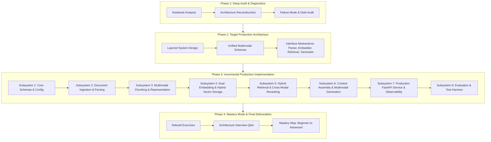

# Multimodal RAG Production Transformation & Mastery Plan

Transforming the NovaCore Multimodal RAG Jupyter notebook (`Build_Multimodal_RAG_NovaCore.ipynb`) into an enterprise-grade, observable, modular, and highly reliable Multimodal RAG platform.

## High-Level Roadmap

---

## User Review Required

> [!IMPORTANT]
> **No code will be modified or added to production until Phase 1 Audit is reviewed and Phase 2 Architecture is finalized with user approval.**
> 
> The project transition follows an incremental teaching model: after each subsystem is explained and implemented, a **Rebuild Exercise** and **Architectural Interview Questions** will be provided before moving to the next component.

---

## Phased Implementation Structure

### Phase 1: Architectural Audit & Notebook Analysis
- **Goal**: Full autopsy of `Build_Multimodal_RAG_NovaCore.ipynb` across 10 dimensions:
  1. Current architecture
  2. End-to-end data flow
  3. Components currently used
  4. What is good
  5. What is experimental / fragile / non-production
  6. Hidden assumptions
  7. Technical debt
  8. Missing production components
  9. Multimodal RAG concepts currently used
  10. Essential multimodal concepts missing

### Phase 2: Target Production Architecture
- **Goal**: Detailed design of target system:
  - Modality ingestion & layout-aware parsing (text, tables, raster images, vector charts).
  - Multimodal normalization: Text summaries vs visual vectors (ColPali/CLIP vs VLM summarization).
  - Chunking strategies: Layout-preserving hierarchical chunking (Parent-Child / contextual chunking).
  - Indexing: Hybrid sparse (BM25) + dense vector search in Pinecone with metadata filtering.
  - Query analysis & routing: Intent classification & multimodal retrieval strategies.
  - Cross-modal reranking (e.g., Cohere/BGE reranker) to eliminate retrieval noise.
  - Generation layer: Unified VLM/LLM orchestrator with strict grounding, token budgeting, and citation anchors.
  - API & Infrastructure: FastAPI, Pydantic v2, structured logging, Prometheus metrics, OpenTelemetry tracing.

### Phase 3: Subsystem-by-Subsystem Implementation
1. **App Foundation & Configuration**: `app/config/`, `app/schemas/`, `.env.example`.
2. **Ingestion & Multimodal Parsing**: `app/parsing/` (layout analysis, OCR fallback, vector graphic extraction, table markdown parser).
3. **Multimodal Chunking & Representation**: `app/chunking/` (contextual parent-child chunking, image metadata anchoring).
4. **Embeddings & Vector Store**: `app/embeddings/`, `app/retrieval/vector_store.py` (abstract provider interface, dimension validation, batch retry).
5. **Hybrid Retrieval & Reranking**: `app/retrieval/` (sparse-dense hybrid retrieval, cross-modal reranker).
6. **Context Assembly & Generation**: `app/generation/` (token-budgeted context formatting, multimodal message building, citation verification).
7. **Production API & Observability**: `app/api/` (FastAPI routes for `/ingest`, `/query`, `/health`, async background tasks, tracing).
8. **Evaluation & Verification**: `app/evaluation/` (RAG Triad: Context Relevance, Groundedness, Answer Relevance, latency & cost tracking).

### Phase 4: Mastery Mode & Final Deliverables
- Rebuild exercises for each subsystem.
- Production readiness checklist & deployment guide (Docker, docker-compose).
- Complete Multimodal RAG Mastery Map (Beginner → Intermediate → Advanced).

---

## Verification Plan

### Automated Verification
- Unit tests (`tests/unit/`) for parsers, chunkers, formatters, and schemas.
- Integration tests (`tests/integration/`) for Pinecone ingestion, Groq VLM calls, and end-to-end `/query` endpoint.
- Regression tests for table markdown preservation and image citation accuracy.

### Manual Verification & Latency Benchmarks
- End-to-end query validation against NovaCore report questions (Text, Table, Graph, Diagram, Cross-modal).
- Verification of citation fidelity (verifying exact page numbers and image references).
